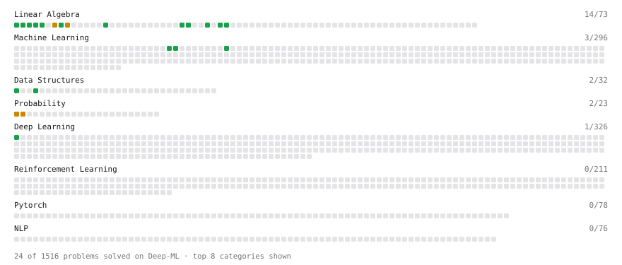

# Deep-ML

My machine learning practice from [Deep-ML](https://www.deep-ml.com). Every solution here was written by hand.

**35** solved · 27 problems · 0 labs · 8 math

[**Browse the interactive portfolio**](https://devjotsinghrai.github.io/deep-ml/) to replay this filling in over time.

## Problems

| | Difficulty | Solved | |
| --- | --- | --- | --- |
| [Calculate 2x2 Matrix Inverse](https://www.deep-ml.com/problems/8) | easy | 2026-10-07 | [solution](problems/0008-calculate-2x2-matrix-inverse) |
| [Calculate Accuracy Score](https://www.deep-ml.com/problems/36) | easy | 2026-10-09 | [solution](problems/0036-calculate-accuracy-score) |
| [Calculate Cosine Similarity Between Vectors](https://www.deep-ml.com/problems/76) | easy | 2026-10-07 | [solution](problems/0076-calculate-cosine-similarity-between-vectors) |
| [Calculate Mean Absolute Error (MAE)](https://www.deep-ml.com/problems/93) | easy | 2026-10-09 | [solution](problems/0093-calculate-mean-absolute-error-mae) |
| [Calculate Mean by Row or Column](https://www.deep-ml.com/problems/4) | easy | 2026-10-07 | [solution](problems/0004-calculate-mean-by-row-or-column) |
| [Calculate R-squared for Regression Analysis](https://www.deep-ml.com/problems/69) | easy | 2026-10-09 | [solution](problems/0069-calculate-r-squared-for-regression-analysis) |
| [Calculate Root Mean Square Error (RMSE)](https://www.deep-ml.com/problems/71) | easy | 2026-10-09 | [solution](problems/0071-calculate-root-mean-square-error-rmse) |
| [Compute the Cross Product of Two 3D Vectors](https://www.deep-ml.com/problems/118) | easy | 2026-10-07 | [solution](problems/0118-compute-the-cross-product-of-two-3d-vectors) |
| [Convert Vector to Diagonal Matrix](https://www.deep-ml.com/problems/35) | easy | 2026-10-07 | [solution](problems/0035-convert-vector-to-diagonal-matrix) |
| [Derivative of a Polynomial](https://www.deep-ml.com/problems/116) | easy | 2026-10-07 | [solution](problems/0116-derivative-of-a-polynomial) |
| [Dot Product Calculator](https://www.deep-ml.com/problems/83) | easy | 2026-10-07 | [solution](problems/0083-dot-product-calculator) |
| [Implement Precision Metric](https://www.deep-ml.com/problems/46) | easy | 2026-10-09 | [solution](problems/0046-implement-precision-metric) |
| [Implement Recall Metric in Binary Classification](https://www.deep-ml.com/problems/52) | easy | 2026-10-09 | [solution](problems/0052-implement-recall-metric-in-binary-classification) |
| [Label Encoding for Ordinal Variables](https://www.deep-ml.com/problems/356) | easy | 2026-10-07 | [solution](problems/0356-label-encoding-for-ordinal-variables) |
| [Matrix Determinant & Trace](https://www.deep-ml.com/problems/195) | easy | 2026-10-07 | [solution](problems/0195-matrix-determinant-trace) |
| [Matrix-Vector Dot Product](https://www.deep-ml.com/problems/1) | easy | 2026-10-07 | [solution](problems/0001-matrix-vector-dot-product) |
| [Min-Max Scaling of Feature Values](https://www.deep-ml.com/problems/112) | easy | 2026-10-07 | [solution](problems/0112-min-max-scaling-of-feature-values) |
| [Reshape Matrix](https://www.deep-ml.com/problems/3) | easy | 2026-10-07 | [solution](problems/0003-reshape-matrix) |
| [Scalar Multiplication of a Matrix](https://www.deep-ml.com/problems/5) | easy | 2026-10-07 | [solution](problems/0005-scalar-multiplication-of-a-matrix) |
| [Sigmoid Activation Function Understanding](https://www.deep-ml.com/problems/22) | easy | 2026-10-08 | [solution](problems/0022-sigmoid-activation-function-understanding) |
| [Transpose of a Matrix](https://www.deep-ml.com/problems/2) | easy | 2026-10-07 | [solution](problems/0002-transpose-of-a-matrix) |
| [Vector Element-wise Sum](https://www.deep-ml.com/problems/121) | easy | 2026-10-07 | [solution](problems/0121-vector-element-wise-sum) |
| [Binomial Distribution Probability](https://www.deep-ml.com/problems/79) | medium | 2026-10-08 | [solution](problems/0079-binomial-distribution-probability) |
| [Find Captain Redbeard's Hidden Treasure](https://www.deep-ml.com/problems/127) | medium | 2026-10-07 | [solution](problems/0127-find-captain-redbeard-s-hidden-treasure) |
| [Matrix times Matrix ](https://www.deep-ml.com/problems/9) | medium | 2026-10-07 | [solution](problems/0009-matrix-times-matrix) |
| [Matrix Transformation ](https://www.deep-ml.com/problems/7) | medium | 2026-10-07 | [solution](problems/0007-matrix-transformation) |
| [Normal Distribution PDF Calculator](https://www.deep-ml.com/problems/80) | medium | 2026-10-08 | [solution](problems/0080-normal-distribution-pdf-calculator) |

## Math

| | Difficulty | Solved | |
| --- | --- | --- | --- |
| [Derivatives and Gradients](https://www.deep-ml.com/math-problems/1) | easy | 2026-10-08 | [solution](math/0001-derivatives-and-gradients) |
| [Descriptive Statistics](https://www.deep-ml.com/math-problems/18) | easy | 2026-10-08 | [solution](math/0018-descriptive-statistics) |
| [Expectation and Variance Algebra](https://www.deep-ml.com/math-problems/33) | easy | 2026-10-08 | [solution](math/0033-expectation-and-variance-algebra) |
| [Matrix Basics](https://www.deep-ml.com/math-problems/9) | easy | 2026-10-08 | [solution](math/0009-matrix-basics) |
| [ML Workflow Basics](https://www.deep-ml.com/math-problems/30) | easy | 2026-10-08 | [solution](math/0030-ml-workflow-basics) |
| [Probability Fundamentals](https://www.deep-ml.com/math-problems/19) | easy | 2026-10-08 | [solution](math/0019-probability-fundamentals) |
| [Vector Operations](https://www.deep-ml.com/math-problems/7) | easy | 2026-10-08 | [solution](math/0007-vector-operations) |
| [Matrix Multiplication](https://www.deep-ml.com/math-problems/10) | medium | 2026-10-08 | [solution](math/0010-matrix-multiplication) |

---

_This file is regenerated by Deep-ML on every push._
